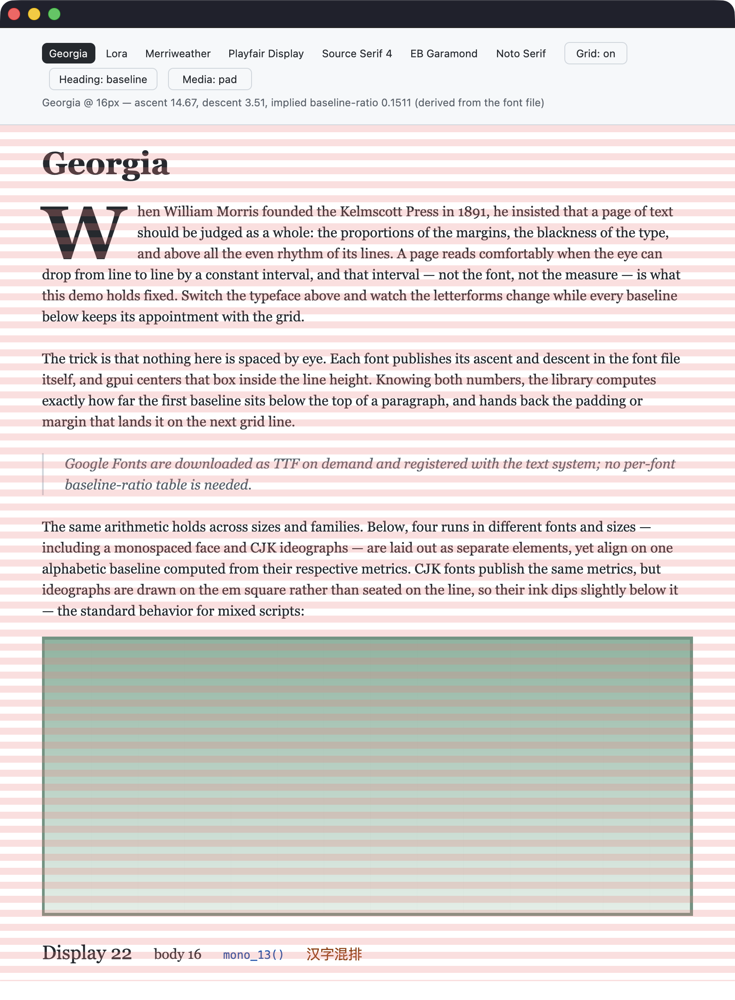

# rhythm-gpui

[](https://github.com/p233/rhythm-gpui/actions/workflows/ci.yml)
[](https://crates.io/crates/rhythm-gpui)
[](https://docs.rs/rhythm-gpui)

Print-inspired vertical rhythm for [gpui](https://www.gpui.rs) — baseline
offsets computed from real font metrics. Ported from
[rhythm-sass](https://github.com/p233/rhythm-sass), its baseline-anchored paths
land text baselines exactly on a vertical rhythm grid. Cap-anchored openings
instead pin the capitals' ink while keeping each block on whole rhythm rows.

Unlike the Sass original, **no hand-measured `baseline-ratio` is required**:
metrics are read from the actual font file through gpui's text system.



_`cargo run --example recipes` — switch the typeface and baseline-anchored text
keeps its appointment with the grid: the drop cap spans three lines,
fluid-width media pads or crops to whole rows at every window width, and four
runs (two serif sizes, monospace, CJK) share a single alphabetic baseline
computed from their respective metrics._

## How it works

gpui (like CSS) vertically centers a font's `ascent + descent` box inside the
line height and places the baseline at:

```text
baseline_from_top = (line_height − ascent − descent) / 2 + ascent
```

Given a line height that is a whole number of rhythm units, this library solves
that equation backwards: it hands you the padding or margin that puts the
baseline on the next grid line. Plumber's famous `baseline-ratio` turns out to be
a closed-form function of the same metrics — `(em + descent − ascent) / (2·em)` —
which is why looking it up per font is no longer necessary.

## Installation

```toml
[dependencies]
rhythm-gpui = "0.2"
```

The crate has two layers behind one package:

- **`gpui` feature** (default) — the gpui integration: metric resolution through
  `TextSystem` (with `RhythmFontSpec` cache keys and the resolved `FontId`),
  `Pixels`-typed spacing, drop caps, the measured `RhythmIcfAnchor` for CJK ink,
  the fluid-width `RhythmFrame` (with its `RhythmFit` pad/crop mode), the
  `RhythmStyled` extension, and the configurable `RhythmOverlay` debug grid.
- **`default-features = false`** — only the dependency-free rhythm math
  (`Rhythm`, `FontRhythm`, `RhythmLineMetrics`, `RhythmBlockMetrics`,
  `DropCapRhythm`, `snap`, and height snapping). Any renderer that centers
  `ascent + descent` inside the line height can feed it metrics — gpui is not
  compiled at all.

The MSRV is Rust 1.85 for the math-only build and is checked in CI; with the
default `gpui` feature the effective minimum follows gpui itself, which does
not declare one.

## Quick start

```rust
use gpui::{div, font, px, prelude::*};
use rhythm_gpui::{RhythmGrid, RhythmStyled};

// Given a GPUI context named `cx`:
// 1. Pick a grid unit (the analog of rhythm-sass `$rhythm-size`).
let grid = RhythmGrid::new(px(8.));

// 2. Derive fonts from the grid. Line height is given in whole rhythm units:
//    3 × 8px = 24px. Metrics are resolved from the font file at this size.
let body = grid.font(cx.text_system(), font("Georgia"), px(16.), 3);
let heading = grid.font(cx.text_system(), font("Georgia"), px(28.), 5);

// 3. Spacing comes from the fonts themselves, wherever gpui expects a length.
div()
    .px(grid.spacing(6))
    .pt(heading.baseline_top(5))
    .child(div().rhythm_font(&heading).child("Title"))
    .child(
        div()
            .rhythm_font(&body)
            .mt(heading.baseline_between(&body, 6))
            .child("Body text, aligned to the grid."),
    )
```

`grid.spacing(n)` is the axis-neutral length of `n` rhythm units, for layouts
that reuse the same scale for horizontal padding, gaps, or indents.
`grid.height(n)` remains the vertical name for the same length.

Everything else — the spacing functions, `RhythmFont` resolution and accessors,
the `RhythmDropCap` / `DropCapRhythm` solvers, the `RhythmStyled` extension, the
`rhythm_frame` / `RhythmFrame` media container, the `rhythm_overlay` /
`RhythmOverlay` debug grid, and the gpui-free math layer — is documented in the
checked-out crate's rustdoc (`cargo doc --open`). Published versions remain
available on **[docs.rs](https://docs.rs/rhythm-gpui)**.

## Demo & recipes

```
cargo run --example recipes   # font picker, drop cap, heading anchor toggle,
                              # fluid media pad/crop, mixed-font baseline row,
                              # grid overlay;
                              # downloads Google Fonts on demand
```

The toolbar follows a single Tab / Shift-Tab order; Enter or Space activates
the focused font or toggle without a separate keyboard-only behavior path.

The example is a recipe collection:

- **Page scaffold** — open with `baseline_top`, chain blocks with
  `baseline_between`, close with `baseline_bottom`.
- **Optical heading** — `cap_top` lands the capitals' _ink_, not the baseline,
  on a grid line; the paired `cap_bottom` returns the trimmed space so the
  block still spans whole rows and everything below stays in rhythm — closing
  with `baseline_bottom` instead would not. Flip the example's heading toggle to
  compare the two openings live: with the cap anchor, switching typefaces
  keeps the ink pinned while the baseline wobbles, and vice versa.
- **Drop cap with true wrap-around** — `body.drop_cap(ts, font, 3)`
  solves the cap size and baseline anchor from metrics; `.rhythm_drop_cap(&cap)`
  applies the anchor as a relative inset, because for cap-heavy faces (cap
  height > ascent − descent, e.g. Merriweather) the anchor is a _downward_
  shift, and a margin would stretch the flex row and push everything below off
  the grid. Wrap-around text splitting: `drop_cap_paragraph` in the example.
- **Media on the grid** — a fluid-width image's height is not generally an exact
  number of rhythm rows, so everything after it would drift off the grid.
  `rhythm_frame(grid, ratio)`, where `ratio` is width divided by height, fits it
  back on: the frame fills the parent's width and snaps its height
  (`width / ratio`) up to whole rhythm rows, leaving the sub-unit remainder
  below the content; `.fit(RhythmFit::Crop)` — or the `.crop()` shorthand —
  snaps down instead, clipping under one unit evenly between the top and
  bottom edges without resizing the content to the snapped height. Taking the
  mode as a value keeps a runtime choice a single call. Style the child to
  fill the frame's natural-ratio content box — use
  `.size_full().object_fit(ObjectFit::Cover)` when the image itself has a
  different ratio.
  Toggle pad/crop in the example and resize the window: the mixed-font row
  below stays in rhythm at every width. With a known column width, skip the
  frame: `div().w(w).h(grid.snap_up(w / ratio))`.
- **Mixed fonts on one baseline** — different sizes, families, and scripts
  aligned on one grid-seated alphabetic baseline. CJK fonts publish the same
  metrics, but ideographs are drawn on the em square, so their ink dips
  slightly below the shared line — standard mixed-script behavior.
- **CJK ink anchor** — twin cards asking for the same thing (ink two rhythm
  units below the card's top edge) with the target drawn as a rule: naive
  `.pt()` misses it by the whole invisible band, a measured
  `RhythmIcfAnchor::span` lands on it. Every edge is a grid citizen — the block
  opens on a grid line, both captions are whole-row rhythm blocks, and each
  card is nine rows tall — so the target rule _is_ a grid line and the overlay
  confirms the claim instead of the caption asserting it. Ordinary Chinese
  paragraphs need no CJK-specific API and the example does not pretend
  otherwise.
- **Debug overlay** — chain `.rhythm_debug_overlay(grid, show)` on the page
  container, after its content children so the stripes paint on top (gpui
  paints later siblings over earlier ones), to toggle the grid while
  developing; every other grid row is painted in the classic translucent red
  so you can verify baseline-anchored text lands on them. The same toggle
  accepts a configured overlay in place of the grid:
  `.rhythm_debug_overlay(grid.overlay(gpui::rgba(0x0969da33)), show)` picks
  the grid color, and `.phase(content_offset_y)` on the overlay accepts the
  same signed Y translation used to paint content for renderers that scroll
  without moving a scroll container. A gpui `ScrollHandle`'s negative
  `offset().y` can be passed through directly. If that translation is not final
  until prepaint, configure a temporary overlay with the settled value and call
  `RhythmOverlay::paint(bounds, window)` during the custom element's paint
  stage; element rendering and direct painting share the same clipping and
  visible-stripe walk.
- **Device-pixel snapping** — the functions are exact to float precision
  (no whole-pixel rounding, unlike the Sass version); use `snap` to round a
  final value to whole device pixels. gpui's `Window::line_height()` helper
  rounds to whole logical pixels, while ordinary `StyledText` preserves an
  explicitly specified pixel line height before Taffy snaps layout edges to
  device-pixel boundaries. Keep `grid × line_rhythms` whole when the value may
  flow through the rounded helper; independently, each final fractional layout
  edge can differ from the exact math by up to half a device pixel.

## CJK (horizontal layout)

**Most CJK typography needs nothing from this section.** Horizontal CJK seats
its glyphs on the same alphabetic baseline Latin uses, and CJK fonts publish
the same `ascent`/`descent`, so `baseline_top` / `baseline_between` /
`rhythm_block` land Chinese, Japanese and Korean on the grid exactly as they
land English. Mixed script usually needs nothing either: a CJK face ships its
own Latin, sized by the same designer to sit with the ideographs — measured,
PingFang SC draws `H` at 0.714 em against its 0.924 em character face — so
setting both scripts in one family is balanced without any compensation.

One thing baseline anchoring cannot do is land ideographic **ink** on a grid
line or a container edge, and that is all the CJK API here is for.

### Why an ink anchor needs a different metric

Latin letters are _seated on_ the baseline — the bottom of x, o, n is the
baseline — which is what lets `cap_top` land visible ink. Ideographs are not:
the baseline merely crosses their design frames, and per-glyph ink varies
wildly inside them (一 is a stroke near the middle, 国 nearly fills the frame,
汉 reaches below the baseline). So a CJK ink anchor targets a frame, and which
frame decides whether ink actually lands. Measured from the font files:

| face                 | ICF `icfb` … `icft` | em box (`ideo`, OS/2 typo) | real ink        |
| -------------------- | ------------------- | -------------------------- | --------------- |
| PingFang SC          | −0.102 … **+0.822** | −0.14 … +0.86              | 字 **+0.825**   |
| Toppan Bunkyu Gothic | −0.080 … **+0.840** | —                          | 漢字 **+0.842** |
| Apple SD Gothic Neo  | −0.150 … **+0.750** | —                          | 한글 **+0.804** |

The **ICF** (ideographic character face) is the envelope full-frame glyphs are
drawn to; the **em box** is the 1 em advance body, which sits ~0.03 em above
_any_ ink, so anchoring it always leaves a visible gap. Anchor the ICF, as CSS
`text-box-edge: ideographic-ink` does. And note the third row: a face's
declared `icft` is not always honest, which is why this crate measures rather
than reads it.

### Measuring the character face

```rust
let heading = grid.font(cx.text_system(), font("PingFang SC"), px(24.), 5);

if let Ok(anchor) = heading.measure_icf(cx.text_system(), "字永語国") {
    let (pt, pb) = anchor.span(2, 0);
    div()
        .pt(pt)
        .pb(pb)
        .rhythm_font(anchor.font())
        .child("中文标题");
}
```

`measure_icf` takes the tallest ink over the probe glyphs, so pass a _set_ of
full-frame glyphs for the script you are setting — 国 alone stops 0.05 em short
of what 字 reaches. Measuring beats reading the font's `BASE` table: SimSong
ships none at all, and Apple SD Gothic Neo's hangul overshoots its declared
`icft` by 0.054 em.

`measure_icf` returns `Result<RhythmIcfAnchor, IcfMeasurementError>`, and a
successful anchor is bound to the exact resolved font, size, and grid it
measured. The base `RhythmFont` remains entirely determined by its
`RhythmFontSpec`, so cache it normally; cache an anchor separately only when
useful, keyed by both the spec and probes. Failure occurs once, here; an
anchor's `span` and `trim_top` are infallible pure geometry.

Availability follows gpui's text backend. In gpui 0.2.2, CoreText and
DirectWrite expose glyph ink bounds, while the Linux backend returns
advance-only placeholder bounds, so measurement there always fails — take the
`ink_anchored` path below instead.

`IcfMeasurementError` is `#[non_exhaustive]`, and its variants report what gpui
made observable rather than a guessed platform cause. A font synthesized
without a `TextSystem` has no resolved `FontId` and returns `UnresolvedFont`.
Empty input returns `EmptyProbes`; when every probe-bound query fails,
measurement returns `NoProbeBounds`; when at least one query returns bounds but
every bound is rejected — the Linux placeholder path — it returns
`NoUsableBounds`. If failed queries and rejected bounds are mixed,
`NoUsableBounds` wins. Probe with glyphs the resolved face actually covers:
CoreText and Linux report a missing glyph as absent, while DirectWrite
substitutes `.notdef`, whose box can pass for ink. Always use the same
`TextSystem` for measurement that resolved the `RhythmFont`.

When a renderer already has a trusted character-face ascent, or its backend
cannot measure one, call `RhythmBlockMetrics::ink_anchored` directly. Passing
an ICF ascent produces the same opening, closing, row, and fragment geometry
without adding measured state to `RhythmFont` or depending on gpui.

Like a cap anchor, this anchors **one** ink envelope: glyphs that reach it land
on the line, shorter ones sit below — exactly as Latin lowercase sits below a
`cap_top` anchor. Kana are the case to know about: their dakuten ride above the
han envelope by up to 0.058 em on the faces measured here, like Latin ascenders
above cap height — though the overshoot belongs to the face and some versions
show none — so include kana in the probes when setting Japanese that must not
exceed the line.

### Worked example: a heading flush to a card edge

You want the _ink_ of that 24px heading to start two rhythm units (16px) below
a card's top edge. Inside its 40px line box, 8.91px above the ink is invisible
— 3.2px of half-leading plus 5.71px from the ascent down to the character
face. So `.pt(px(16.))` puts the ink at **24.91px**: you asked for 16 and the
eye sees nearly 25, more than a whole rhythm unit out, and the error changes
with every size and face. `anchor.span(2, 0)` returns 7.088px and 8.912px
instead — subtracting the invisible band at the top and handing it back at the
bottom, so the ink lands at 16.00px and the block is still 56px = 7 whole rows.

This is the same problem CSS added `text-box-trim` for, and the same one
`cap_top` already solves for Latin; `RhythmIcfAnchor::span` is its CJK
counterpart. Their shapes differ intentionally: a cap height, when present,
arrives with the metrics resolved into `RhythmFont`, so `cap_span` lives on the
font. An ICF ascent depends on backend measurement and caller-selected probes,
so only a successfully measured `RhythmIcfAnchor` exposes `span`.

### What is deliberately absent

- **No Latin/CJK layout mode.** Both scripts share one baseline in horizontal
  layout, so which script leads is a per-block choice of anchor.
- **No cross-script size solver.** Prefer the CJK face's own Latin, which its
  designer already balanced. If you deliberately pair a separate Latin face,
  the compensation is one line from metrics this crate already exposes:
  `latin_size = latin.font_size() * target_cap / latin.metrics().cap_height()?`.
  Choose `target_cap` by measuring what the CJK face does with its own Latin
  (PingFang 0.773 of its character face, Hiragino Sans GB 0.855) — there is no
  universal constant.
- **No CJK drop cap.** Drop caps are a Latin convention; CJK paragraphs open
  with a first-line indent.
- **Treat a CJK face's reported cap and x heights as unverified.** PingFang SC
  publishes `sCapHeight` 0.860 em — a copy of its `sTypoAscender` — while its
  Latin `H` really reaches 0.714 em, and `sxHeight` 0.600 against a real 0.517.
  `cap_top` therefore returns a plausible, wrong value on CJK faces.
- **Vertical layout, line-breaking, and punctuation compression** are out of
  scope: they belong to shaping, not to grid geometry.

## Custom renderers (direct paint)

```
cargo run --example direct_paint   # shape once, cache WrappedLines,
                                   # paint straight onto the grid
```

Document renderers that shape text themselves skip the element layer: build
`RhythmLineMetrics` from each shaped line's reported `ascent()` / `descent()` —
the maxima over its explicit font runs, which is how lines mixing bold,
inline code, CJK, or emoji faces actually shape — lay blocks out with
`RhythmBlockMetrics` (baseline or ink-top anchors, concrete fragment geometry,
and exact integer row arithmetic), and place every baseline with
`paint_origin_for(target)`. On the validated macOS/CoreText backend,
glyph-level fallback does not enlarge a `WrappedLine`'s `ascent()` / `descent()`;
that describes the shaped line metrics, not a guarantee that every fallback
glyph's typographic or raster ink stays inside the primary face's line box.

Settle the row budget at catalog-build time. A style's lines can draw on more
faces than its own — bold, inline code, or an explicit CJK or emoji face — and
each line shapes to the maxima over its explicit runs.
`RhythmFontSpec::resolve_covering(ts, &others)` resolves the style's font at a
line height that holds any mixture of that same-size, same-grid, caller-supplied
set (`RhythmLineMetrics::covering` is the pure form). Each listed family still
uses gpui's normal resolution fallback when the request is missing, but neither
entry inspects text or discovers glyph-level fallback faces selected later by
the platform shaper. Nothing is shaped to compute the budget, which is what
makes a block's height a function of its line count — the property
virtualization needs.

For a dynamic, non-virtualized line whose configured height is only a floor,
`line_metrics_at_least` remains the one-step overflow-growing path. The fixed
covering budget is the stronger contract when block height must be known before
shaping.

Virtualization runs on integer rows: `first_rows` / `middle_rows` /
`last_rows` are ordered `i32` cursor transitions that partition `rows(lines)`
across a split block. Accumulate them in an `i64`; `baseline_at_row(cursor)`
turns the rebased visible row into its baseline, and `paint_origin_for` then
locates that fragment's line-box top. The final coordinate is still `f32`, so
rebase near the viewport rather than converting an enormous absolute row. A
virtualizer therefore converts only visible positions instead of summing
`f32` heights over thousands of blocks. The `direct_paint` example deliberately
shows the non-virtualized whole-document path; a production virtualizer owns
the absolute `i64` row and viewport-row origin needed for this rebase. Four
values carry `Pixels`-typed `_px` mirrors — `line_height_px`,
`paint_origin_for_px`, `first_baseline_px`, and `baseline_at_row_px` — the ones
that stay inside a paint path's `Pixels` chain: two reach
`WrappedLine::paint`, and two are summed with grid lengths into the target
baseline `paint_origin_for_px` consumes. The rest is read once and stays
`f32`: `px(...)` at the call site is one conversion, where a mirror per
accessor would double the surface to save it.

The lifecycle contract: a `RhythmFont` is an immutable resolved value. Within
the crate, only its resolution factories query the `TextSystem`; document
renderers still use `shape_text` when their shaped-line cache is stale. Once
metrics are available, the `Rhythm` / `FontRhythm` / line/block geometry paths
are allocation-free `Copy` math (a counting-allocator test enforces that exact
scope). Key caller-owned resolution caches with `RhythmFontSpec`; the crate
keeps no cache of its own. Register a family before its first resolution — gpui
caches failed font requests, so clearing a caller cache after late registration
cannot repair the miss in the same `TextSystem`. The default gpui layer is
compile-checked on Linux and Windows. Mixed-run and glyph-fallback shaping
semantics are CI-verified against macOS/CoreText (`tests/shaping.rs`); the
DirectWrite and cosmic-text runtime behaviors are not yet verified. Those
line-metrics checks also do not establish fallback-glyph ink containment.

**Tip:** as with rhythm-sass, make every text block occupy a whole number of
rhythm units. Line heights are whole units by construction; close a
baseline-anchored block with `baseline_bottom`, or a cap-anchored block with
the paired `cap_bottom`. Blocks then compose freely without breaking the page
rhythm. `.rhythm_block(&font, top, bottom)` applies the baseline-paired recipe
(font + both paddings) in one call, and `font.cap_span(top, bottom)` hands the
cap pair back as one value, reducing the chance of applying mismatched anchors.

## Development

```
git config core.hooksPath .githooks   # once per clone
```

The `pre-commit` hook runs `rustfmt` over the staged `.rs` files and re-stages
them, so what you commit already satisfies CI's `cargo fmt --check`. Markdown,
YAML and JSON are formatted too when Prettier is on `PATH`.

On macOS, `cargo test` also runs the real-shaping suite (`tests/shaping.rs`),
which briefly opens a window — AppKit shaping needs one — and reads the OFL
Noto fonts bundled under `tests/fonts/`. `cargo bench --bench resolve` tracks
warm font-resolution cost as a local dev tool; there is no ns-level CI gate.

`cargo test --features test-support` additionally runs the headless GPUI layout
regression tests; application code does not need this feature.

## Credits

Ported from [rhythm-sass](https://github.com/p233/rhythm-sass), which builds on
concepts introduced by [Plumber](https://jamonserrano.github.io/plumber-sass/).

## License

[MIT](./LICENSE)
