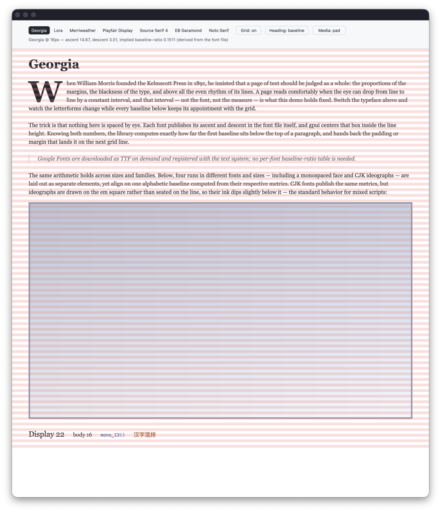

# rhythm-gpui

[](https://github.com/p233/rhythm-gpui/actions/workflows/ci.yml)
[](https://crates.io/crates/rhythm-gpui)
[](https://docs.rs/rhythm-gpui)

Print-inspired vertical rhythm for [gpui](https://www.gpui.rs) — baseline
offsets computed from real font metrics. Ported from
[rhythm-sass](https://github.com/p233/rhythm-sass), it lands every text
baseline exactly on a vertical rhythm grid, giving you pixel-perfect control
over typographic layout in gpui apps.

Unlike the Sass original, **no hand-measured `baseline-ratio` is required**:
metrics are read from the actual font file through gpui's text system.



_`cargo run --example demo` — switch the typeface and every baseline keeps its
appointment with the grid: the drop cap spans three lines, fluid-width media
pads or crops to whole rows at every window width, and four runs (serif,
monospace, CJK) share a single alphabetic baseline computed from their
respective metrics._

## How it works

gpui (like CSS) vertically centers a font's `ascent + descent` box inside the
line height and places the baseline at:

```text
baseline_from_top = (line_height − ascent − descent) / 2 + ascent
```

Given a line height that is a whole number of rhythm units, this library solves
that equation backwards: it hands you the padding or margin that puts the
baseline on the next grid line. Plumber's famous `baseline-ratio` turns out to be
a closed-form function of the same metrics — `(em + descent − ascent) / (2·em)` —
which is why looking it up per font is no longer necessary.

## Installation

```toml
[dependencies]
rhythm-gpui = "0.2"
```

The crate has two layers behind one package:

- **`gpui` feature** (default) — the gpui integration: metric resolution through
  `TextSystem` (with `RhythmFontSpec` cache keys and the resolved `FontId`),
  `Pixels`-typed spacing, drop caps, the fluid-width `RhythmFrame`, the
  `RhythmStyled` extension, and the debug overlay.
- **`default-features = false`** — only the dependency-free rhythm math
  (`Rhythm`, `FontRhythm`, `RhythmLineMetrics`, `RhythmBlockMetrics`,
  `DropCapRhythm`, `snap`, and height snapping). Any renderer that centers
  `ascent + descent` inside the line height can feed it metrics — gpui is not
  compiled at all.

The MSRV is Rust 1.85 for the math-only build and is checked in CI; with the
default `gpui` feature the effective minimum follows gpui itself, which does
not declare one.

## Quick start

```rust
use gpui::{div, font, px, prelude::*};
use rhythm_gpui::{RhythmGrid, RhythmStyled};

// Given a GPUI context named `cx`:
// 1. Pick a grid unit (the analog of rhythm-sass `$rhythm-size`).
let grid = RhythmGrid::new(px(8.));

// 2. Derive fonts from the grid. Line height is given in whole rhythm units:
//    3 × 8px = 24px. Metrics are resolved from the font file at this size.
let body = grid.font(cx.text_system(), font("Georgia"), px(16.), 3);
let heading = grid.font(cx.text_system(), font("Georgia"), px(28.), 5);

// 3. Spacing comes from the fonts themselves, wherever gpui expects a length.
div()
    .pt(heading.baseline_top(5))
    .child(div().rhythm_font(&heading).child("Title"))
    .child(
        div()
            .rhythm_font(&body)
            .mt(heading.baseline_between(&body, 6))
            .child("Body text, aligned to the grid."),
    )
```

Everything else — the spacing functions, `RhythmFont` resolution and accessors,
the `RhythmDropCap` / `DropCapRhythm` solvers, the `RhythmStyled` extension, the
`rhythm_frame` / `RhythmFrame` media container, the `rhythm_overlay` debug grid,
and the gpui-free math layer — is documented on
**[docs.rs](https://docs.rs/rhythm-gpui)**.

## Demo & recipes

```
cargo run --example demo   # font picker, drop cap, heading anchor toggle,
                           # fluid media pad/crop, mixed-font baseline row,
                           # grid overlay;
                           # downloads Google Fonts on demand
```

The demo doubles as a recipe collection:

- **Page scaffold** — open with `baseline_top`, chain blocks with
  `baseline_between`, close with `baseline_bottom`.
- **Optical heading** — `cap_top` lands the capitals' _ink_, not the baseline,
  on a grid line; the paired `cap_bottom` returns the trimmed space so the
  block still spans whole rows and everything below stays in rhythm — closing
  with `baseline_bottom` instead would not. Flip the demo's heading toggle to
  compare the two openings live: with the cap anchor, switching typefaces
  keeps the ink pinned while the baseline wobbles, and vice versa.
- **Drop cap with true wrap-around** — `body.drop_cap(ts, font, 3)`
  solves the cap size and baseline anchor from metrics; `.rhythm_drop_cap(&cap)`
  applies the anchor as a relative inset, because for cap-heavy faces (cap
  height > ascent − descent, e.g. Merriweather) the anchor is a _downward_
  shift, and a margin would stretch the flex row and push everything below off
  the grid. Wrap-around text splitting: `drop_cap_paragraph` in the demo.
- **Media on the grid** — a fluid-width image's height is not generally an exact
  number of rhythm rows, so everything after it would drift off the grid.
  `rhythm_frame(grid, ratio)`, where `ratio` is width divided by height, fits it
  back on: the frame fills the parent's width and snaps its height
  (`width / ratio`) up to whole rhythm rows, leaving the sub-unit remainder
  below the content; `.crop()` snaps down instead, clipping under one unit
  evenly between the top and bottom edges without resizing the content to the
  snapped height. Style the child to fill the frame's natural-ratio content box
  — use `.size_full().object_fit(ObjectFit::Cover)` when the image itself has a
  different ratio.
  Toggle pad/crop in the demo and resize the window: the mixed-font row
  below stays in rhythm at every width. With a known column width, skip the
  frame: `div().w(w).h(grid.snap_up(w / ratio))`.
- **Mixed fonts on one baseline** — different sizes, families, and scripts
  aligned on one grid-seated alphabetic baseline. CJK fonts publish the same
  metrics, but ideographs are drawn on the em square, so their ink dips
  slightly below the shared line — standard mixed-script behavior.
- **Debug overlay** — chain `.rhythm_debug_overlay(grid, show)` on the page
  container to toggle the stripes while developing; every other grid row is
  painted so you can verify baselines land on them. The underlying
  `rhythm_overlay(grid, color)` element takes a custom color.
- **Device-pixel snapping** — the functions are exact to float precision
  (no whole-pixel rounding, unlike the Sass version); use `snap` to round a
  final value to whole device pixels. gpui rounds text line heights to whole
  logical pixels and snaps Taffy layout edges to device-pixel boundaries. Keep
  `grid × line_rhythms` whole in logical pixels so gpui does not alter the line
  height; each remaining fractional layout edge can differ from the exact math
  by up to half a device pixel.

## Custom renderers (direct paint)

```
cargo run --example direct_paint   # shape once, cache WrappedLines,
                                   # paint straight onto the grid
```

Document renderers that shape text themselves skip the element layer: build
`RhythmLineMetrics` from each shaped line's real `ascent()` / `descent()` —
the maxima over its explicit font runs, which is how lines mixing bold,
inline code, CJK, or emoji faces actually shape — lay blocks out with
`RhythmBlockMetrics` (baseline- or cap-anchored, with first/middle/last
fragment heights that keep the rhythm phase across virtualized splits), and
place every baseline with `paint_origin_for(target)`. Glyph fallback needs no
special handling: substituted glyphs never grow the line box.

Two conveniences for that path: `first_rows` / `middle_rows` / `last_rows` are
ordered integer cursor transitions that partition `rows(lines)` across a split
block. After a first or middle fragment, `continuation_baseline(cursor)` turns
the accumulated row back into the next baseline (including a cap anchor's
phase); `paint_origin_for` then locates that fragment's line-box top. A
virtualizer therefore converts only visible positions instead of summing `f32`
heights over thousands of blocks. `line_metrics_at_least(ascent, descent, n)`
also treats the style's line height as a floor, growing the box in one step when
an explicit run shaped taller than the style predicted. Both metric types carry
`Pixels`-typed `_px` mirrors (`line_height_px`, `baseline_above_px`,
`paint_origin_for_px`, the block baselines and heights) so a gpui paint path
never converts by hand.

The lifecycle contract: a `RhythmFont` is an immutable resolved value. Within
the crate, only its resolution factories query the `TextSystem`; document
renderers still use `shape_text` when their shaped-line cache is stale. Once
metrics are available, the `Rhythm` / `FontRhythm` / line/block geometry paths
are allocation-free `Copy` math (a counting-allocator test enforces that exact
scope). Key caller-owned resolution caches with `RhythmFontSpec`; the crate
keeps no cache of its own. Register a family before its first resolution — gpui
caches failed font requests, so clearing a caller cache after late registration
cannot repair the miss in the same `TextSystem`. Mixed-run and glyph-fallback
shaping semantics are CI-verified against macOS/CoreText (`tests/shaping.rs`);
other gpui text backends are not yet verified.

**Tip:** as with rhythm-sass, make every text block occupy a whole number of
rhythm units. Line heights are whole units by construction; close a
baseline-anchored block with `baseline_bottom`, or a cap-anchored block with
the paired `cap_bottom`. Blocks then compose freely without breaking the page
rhythm. `.rhythm_block(&font, top, bottom)` applies the baseline-paired recipe
(font + both paddings) in one call, and `font.cap_span(top, bottom)` hands the
cap pair as one value so the anchors cannot be mismatched.

## Development

```
git config core.hooksPath .githooks   # once per clone
```

The `pre-commit` hook runs `rustfmt` over the staged `.rs` files and re-stages
them, so what you commit already satisfies CI's `cargo fmt --check`. Markdown,
YAML and JSON are formatted too when Prettier is on `PATH`.

On macOS, `cargo test` also runs the real-shaping suite (`tests/shaping.rs`),
which briefly opens a window — AppKit shaping needs one — and reads the OFL
Noto fonts bundled under `tests/fonts/`. `cargo bench --bench resolve` tracks
warm font-resolution cost as a local dev tool; there is no ns-level CI gate.

`cargo test --features test-support` additionally runs the headless GPUI layout
regression tests; application code does not need this feature.

## Credits

Ported from [rhythm-sass](https://github.com/p233/rhythm-sass), which builds on
concepts introduced by [Plumber](https://jamonserrano.github.io/plumber-sass/).

## License

[MIT](./LICENSE)
